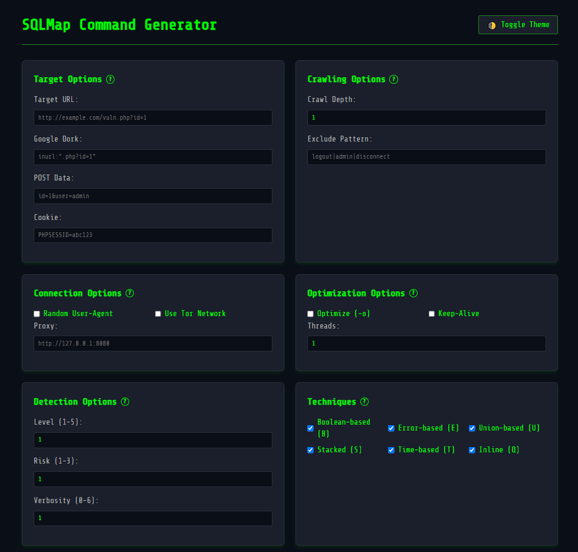

# SQLMap Command Generator
 </img>

## Description

SQLMap Command Generator is a web-based application designed to assist penetration testers and security enthusiasts in generating SQLMap commands with various options for testing SQL injection vulnerabilities. It provides an easy-to-use interface where users can configure various parameters, such as target URL, Google dork, POST data, connection options, detection levels, and techniques for SQL injection.

## Features

- **Target Configuration**: Define target URL or Google dork.
- **Connection Options**: Configure proxy, random user-agent, and use Tor network.
- **Detection Options**: Set the test level, risk, and verbosity.
- **Injection Techniques**: Select from multiple SQL injection techniques, including boolean-based, error-based, union-based, and more.
- **Enumeration Options**: Choose data to extract from the database (e.g., tables, columns, passwords).
- **Advanced Options**: Configure additional attack options like OS shell, OS pwn, and batch mode.

## Requirements

- A Unix-based operating system (Linux/macOS).
- Python 3.x.
- Firefox (for opening the SQLMap interface).


## Web Usage Live

https://acorzo1983.github.io/SQLMapCG/


## Installation & Usage

To install and run the application, follow these steps:

0. **OneLiner Automatic Install and Run**:

```bash
git clone https://github.com/Acorzo1983/SQLMapCG.git && cd SQLMapCG && chmod +x run.sh && ./run.sh
```

1. **Clone the repository**:

   ```bash
   git clone https://github.com/Acorzo1983/SQLMapCG.git
   ```

2. **Navigate to the project directory**:

   ```bash
   cd SQLMapCG
   ```

3. **Make the `run.sh` script executable**:

   ```bash
   chmod +x run.sh
   ```

4. **Run the script**:

   ```bash
   ./run.sh
   ```

   This will start an HTTP server on an available port (either 8082-8085 or a custom port you specify) and open the web application in Firefox automatically.

## Available Options

- **Target URL**: Input the target URL to be tested (e.g., `http://example.com/vuln.php?id=1`).
- **Google Dork**: Use a Google dork to find vulnerable pages (e.g., `inurl:".php?id=1"`).
- **POST Data**: Provide any POST data parameters.
- **Cookie**: Provide any cookies needed for the session.

## Troubleshooting

- **Port Availability**: The script will check if ports 8082-8085 are available. If none of them are free, it will prompt you to choose another port.
- **Permissions**: Ensure you have the required permissions to run the script and make the `run.sh` file executable.
- **Dependencies**: The script assumes that `python3` and `firefox` are installed on your system.

## License

This project is licensed under the MIT License - see the [LICENSE](LICENSE) file for details.

---

Made with ❤️ by Albert C (2024)
